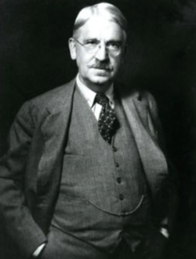

# Sébastien Lemoine

- 🗂️ [Protfolio](https://sebloclock.github.io)
- 🟦 [Profil Linkedin](https://www.linkedin.com/in/s%C3%A9bastien-lemoine-679b3b52/)

## La vie est faite de connaissances, et, la connaissance, c'est la vie.

Il y a des parcours qui se dessinent comme une œuvre d’art, où chaque coup de pinceau représente une étape de la vie, une nouvelle compétence acquise, une passion découverte. Le mien est un peu de cette trempe-là. Plongé dans l’univers captivant du développement, j’ai trouvé mon sanctuaire dans les lignes de code, ces suites de caractères mystérieuses pour certains, mais pour moi, une langue universelle et fascinante. J’ai suivi une formation en développement, une aventure initiatique qui a posé les fondations solides de mon expertise technique et qui m’a permis de plonger dans les abysses du code avec une curiosité insatiable.
Au-delà des lignes de code, ce qui me fait vibrer, c’est l’idée de transmettre ce savoir, cette flamme. J’ai eu le privilège d’endosser le rôle de formateur, une expérience humaine riche et gratifiante. Enseigner, ce n’est pas seulement partager des connaissances, c’est aussi inspirer, guider, et parfois même apprendre autant de ses élèves que ce qu’on leur enseigne. C’est une interaction, une danse intellectuelle où chacun ressort grandi.

« L’éducation, c’est la vie même, et non une préparation à la vie. »

John Dewey

Aujourd’hui, j’ai franchi une nouvelle étape dans mon parcours en devenant responsable de formation. Un rôle qui me permet d’allier stratégie et pédagogie, de concevoir des programmes qui forgent les esprits de demain. C’est une mission qui résonne profondément avec ma citation préférée : « L’éducation, c’est la vie même, et non une préparation à la vie. » Cette phrase résume parfaitement ma vision : éduquer, c’est vivre, c’est évoluer en continu, c’est embrasser chaque opportunité d’apprentissage comme une partie intégrante de notre existence.
Ainsi, entre passion pour le code et amour pour la transmission du savoir, je navigue sur ce fleuve incessant de l’éducation et de l’innovation, avec pour boussole une conviction inébranlable : chaque jour est une nouvelle ligne de code à écrire dans le grand programme de la vie.
